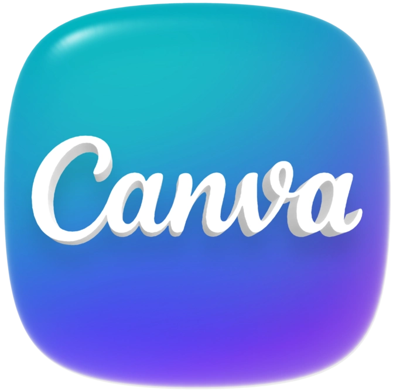

# 👋 Hi, this is Saswata 

💻 **Full-Stack Engineer | AI Product Builder | National Hackathon Winner | Active Open-Source Contributor**  
Passionate about solving real-world problems with technology. I take ideas from zero to production, make them reliable, and ship fast when it matters. I like crafting things that get used. Worked alongside frontier AI teams including xAI, OpenAI, Meta, and Google DeepMind on high-fidelity RL environments and curated datasets. 

When speed matters, deadlines are tight and output matters, I take ownership, design clean systems, and ship fast without compromising on the quality structure. Give me ownership and a tight deadline, I’ll give you a quality product.

📍 Kolkata ✈️ Bangalore

🌐 [Resume](https://drive.google.com/file/d/15_caLuQ2qWWHripFsHkzWeFM3t8JMbw1/view?usp=drive_link)
🌐 [Portfolio](https://docs.google.com/document/d/1xqkHSIuxrC1riBB_X1UvXqMknv3ooEAm7xAzytPymYI/edit?usp=drive_link)  

<!-- --- -->
<h3 align="center">💻 Tech Stack</h3>

<table>
  <tr>
    <td align="left" valign="middle"><strong>🧠 Languages</strong></td>
    <td align="left" valign="middle">
      
    </td>
  </tr>

  <tr>
    <td align="left" valign="middle"><strong>⚙️ Backend & Frameworks</strong></td>
    <td align="left" valign="middle">
      
    </td>
  </tr>

  <tr>
    <td align="left" valign="middle"><strong>🎨 Frontend</strong></td>
    <td align="left" valign="middle">
      
    </td>
  </tr>

  <tr>
    <td align="left" valign="middle"><strong>🗄️ Databases</strong></td>
    <td align="left" valign="middle">
      
      
    </td>
  </tr>

  <tr>
    <td align="left" valign="middle"><strong>☁️ DevOps & Hosting</strong></td>
    <td align="left" valign="middle">
      
      
      
    </td>
  </tr>

  <tr>
    <td align="left" valign="middle"><strong>🧮 Data Science / ML</strong></td>
    <td align="left" valign="middle">
      
      
      
    </td>
  </tr>

  <tr>
    <td align="left" valign="middle"><strong>🧰 Tools & IDEs</strong></td>
    <td align="left" valign="middle">
      
      
      
      
    </td>
  </tr>
</table>

<h3 align="center">🐍 Contribution Snake</h3>

  <picture>
    <source media="(prefers-color-scheme: dark)" srcset="https://raw.githubusercontent.com/techSaswata/techSaswata/output/github-contribution-grid-snake-dark.svg">
    <source media="(prefers-color-scheme: light)" srcset="https://raw.githubusercontent.com/techSaswata/techSaswata/output/github-contribution-grid-snake.svg">
    
  </picture>

<!-- --- -->

## About Me
- 💼 TechFest, IITB 2025 Winner
- 🎓 **B.Sc. in Computer Science** – Birla Institute of Technology & Science (BITS), CGPA: 8.89  
- 🏆 JEE Advanced 2024 – AIR **4039**
- 🛠️ **2x Grand Finalist** – Smart India Hackathon 2024 & 2025  
- 🌍 Active in open-source – **2x Hacktoberfest SuperContributor**, **GSSoC Extd. 2024 Contributor**  
- 🎬 Creator – Scaling YouTube & LinkedIn to 1K+ followers with tech storytelling
<!-- - 📈 Competitive Programmer: **Expert @Codeforces (1660)** | **4⭐ @CodeChef (1957)** -->  

<!-- --- -->
## Wall of Hacktoberfest

## 💼 Experience  

<!--
### 🔹 Founder – [eDastavez] *(Aug 2025 – Jan 2026)*  
- Reduced contract creation time from **5 days to <10 minutes** using Aadhaar eSign, DigiLocker, MetaMask & blockchain.  
- Curated 100+ lawyer-approved templates.  
- Projected to handle **500+ contracts/quarter** with AI-assisted drafting.  -->

### 🔹 Ex-SDE Intern – [InterviewBit (ScalerAI Labs)](https://scalerailabs.com/) *(Oct 2025 – Jan 2026)*
- Worked closely with xAI, openAI, Meta and Google Deepminds to deliver high quality RL Environments

### 🔹 Ex-Lead Developer Intern – [MentiBY](https://mentiby.com) *(Apr 2025 – Dec 2025)*  
- Built an **AI calling agent** with Twilio + ElevenLabs (boosted engagement by 70%).  
- Developed the company site & admin panel → 2× engagement, 90% less admin overhead.  

### 🔹 Co-Team Lead – [Smart Attendance Automation](https://github.com/techSaswata/Smart-Attendance-System) *(Feb 2025 – Apr 2025)*  
- iOS app with Wi-Fi + Vision API for **5× more accurate attendance validation**.  
- Serving **1200+ daily users**.  
- Integrated Vertex AI + Spring Boot APIs (95% faster data processing).  

### 🔹 Team Lead – [LifelineX](https://drive.google.com/drive/folders/1EeO1gkfqmVTPYmxTtU9GdEZplqs2g7ay?usp=sharing) *(Sept 2024 – Dec 2024)*  
- AI-powered **emergency response drone**.  
- Real-time video via RF at 1 FPS + YOLO human detection.  
- Selected for **Smart India Hackathon 2024 Grand Finale**.  

<!-- --- -->
## 📊 Stats & Contributions

  <!--  -->
  

<!-- --- -->

  

<!-- --- -->

## 🛠️ Projects  

- **[ClipSas](https://github.com/techSaswata/ClipSas)** – Mac clipboard manager with **200+ users**, built before Apple’s official tool.  
- **[Nebula](https://github.com/techSaswata/Nebula)** – Exam prep platform with an **AI Interviewer** + payment integration.  
- **[Smart Attendance Automation](https://github.com/techSaswata/Smart-Attendance-System)** – Face-recognition attendance app, serving **1200+ students daily**.  
- **[LifelineX](https://drive.google.com/drive/folders/1EeO1gkfqmVTPYmxTtU9GdEZplqs2g7ay?usp=sharing)** – Emergency drone with SOS messaging + human detection.  

<!-- --- -->

<!-- ## 🧰 Tech Stack  

**Languages:** Java, C++, Golang, Python, Kotlin, Swift, JavaScript, TypeScript, HTML, CSS  
**Frameworks & Tools:** Next.js, React.js, SwiftUI, Spring Boot, FastAPI, Flask, SQLAlchemy, Docker, PostgreSQL, MySQL, Flutter, OpenCV, Pandas, NumPy   -->

<!-- --- -->

## 🌟 Leadership & Community  

- **Grunfeld (Open Source Club)** – Crew Member | Organized hackathons & mentored contributors.  
- **Media Club** – Covered campus events with video editing & social strategy.  
- **SST Innovation Lab** – Core Member | Projects: LifeLineX, Smart Attendance Automaion, TruthTale  
- **Creator’s Club** – Elite Member | Content creation, hosting sessions with educators & YouTubers.  

<!-- ---

## 📊 GitHub Stats   -->

<!-- 

  
  

 -->

<!-- 

  

 -->

<!-- --- -->

## 📫 Let’s Connect  

  
  
  

  <!-- TODO: add your profile URLs below -->
  
  
  

---

*"I'm both the solver and the unsolved"*
-- techSas ❤️ 
